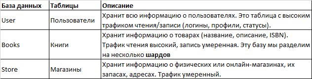
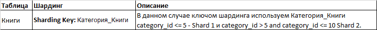
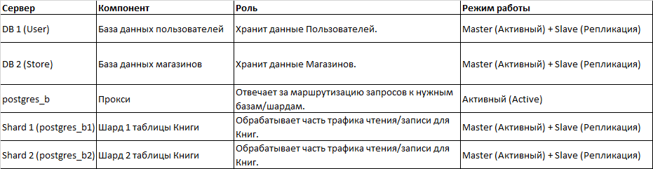

## Домашнее задание к занятию «Репликация и масштабирование. Часть 2» - Айткожоев Бактыбек

### Задание 1
Опишите основные преимущества использования масштабирования методами:

1. активный master-сервер и пассивный репликационный slave-сервер;
Эта конфигурация является базовой используется для отказоустойчивости (Fault Tolerance) и восстановления после сбоев (Disaster Recovery).

2. master-сервер и несколько slave-серверов;
Эта конфигурация является решением для масштабирования чтения (Read Scaling) и используется для высоконагруженных веб-приложений.
Дайте ответ в свободной форме.

### Задание 2
Разработайте план для выполнения горизонтального и вертикального шаринга базы данных. База данных состоит из трёх таблиц:
пользователи,
книги,
магазины (столбцы произвольно).
Опишите принципы построения системы и их разграничение или разбивку между базами данных.
Пришлите блоксхему, где и что будет располагаться. Опишите, в каких режимах будут работать сервера.
```
Используем Вертикальный шардинг для разделения таблиц по функциональности 
а Горизонтальный шардинг для масштабирования самой большой таблицы по объему данных.
```
#### Вертикальный шардинг (Vertical Sharding)
```
Разделяем таблиц по функциональной области на разные базы данных.
```


#### Горизонтальный шардинг (Horizontal Sharding)
```
Разделяем крупную таблицу Книги на несколько идентичных шардов в разных базах данных.
```


#### Блоксхема системы

```
Режимы работы серверов
Каждая база данных (UserDB, StoreDB) и каждый шард (Shard 1, Shard 2) будет работать в режиме Active Master + Passive Slave.
Master-сервер (Активный):
Обрабатывает все операции записи (WRITE) (INSERT, UPDATE, DELETE) для своего набора данных.
Обрабатывает часть операций чтения.
Генерирует бинарные логи (Binary Logs) для репликации.

Slave-сервер (Репликационный/Пассивный):
Постоянно синхронизируется с Master-сервером.
Основное назначение: Обработка большей части операций чтения (READ), тем самым снимая нагрузку с Master.
Резерв: В случае отказа Master-сервера, Slave повышается до нового Master.

Разграничение:
UserDB и StoreDB изолированы. Ссылки между ними обрабатываться в приложении, используя внешний ключ, а не SQL-запрос с JOIN между разными базами.
CatalogDB (Шарды): Приложение через Router определяют, в каком шарде находится нужная книга. Если поиск по всем книгам (например, "все книги по названию"), то прокси выполнить запрос параллельно на всех шардах, а затем объединить результаты.
```
### Дополнительные задания (со звёздочкой*)
Эти задания дополнительные, то есть не обязательные к выполнению, и никак не повлияют на получение вами зачёта по этому домашнему заданию. Вы можете их выполнить, если хотите глубже шире разобраться в материале.

### Задание 3*
Выполните настройку выбранных методов шардинга из задания 2.
Пришлите конфиг Docker и SQL скрипт с командами для базы данных.
#### Команда
```
Конфиг Docker и SQL скрипт в приложении проекта 
```


